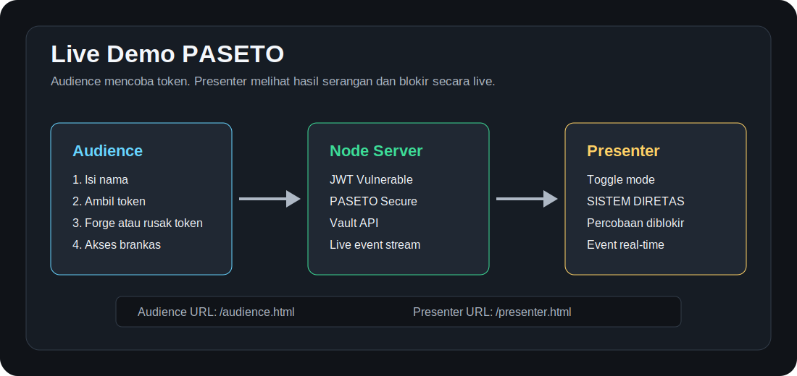
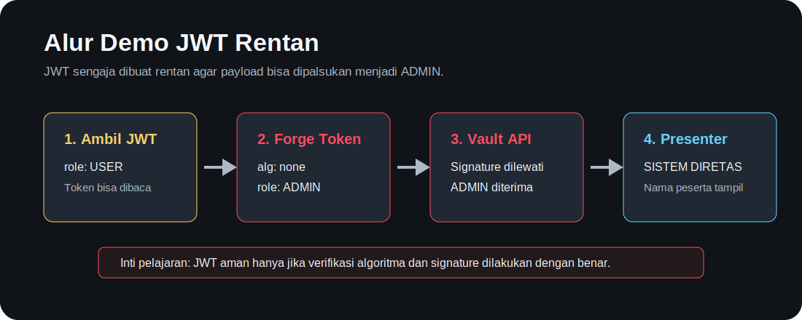
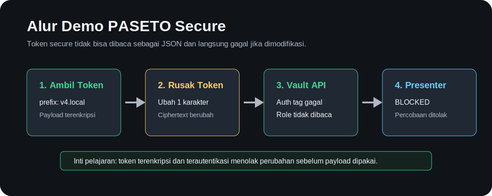

# Live Demo PASETO

Live Demo PASETO adalah aplikasi demo interaktif untuk presentasi keamanan token. Demo ini memperlihatkan perbedaan antara JWT yang sengaja dibuat rentan terhadap `alg:none` dan token secure bergaya PASETO `v4.local` yang terenkripsi serta menolak perubahan satu karakter.



## Isi Demo

- Halaman audience untuk peserta mengisi nama, mengambil token, dan mencoba akses brankas.
- Halaman presenter untuk menampilkan mode keamanan dan event live saat demo berjalan.
- Mode `JWT Vulnerable` yang sengaja menerima token palsu `alg:none`.
- Mode `PASETO Secure` yang memakai token `v4.local` terenkripsi dengan AEAD `AES-256-GCM`.
- Event real-time memakai Server-Sent Events, jadi presenter langsung mendapat notifikasi saat ada percobaan berhasil atau diblokir.

## Prasyarat

Pastikan sudah ada:

- Node.js versi 20 atau lebih baru.
- Browser modern seperti Chrome, Edge, Safari, atau Firefox.
- Koneksi Wi-Fi yang sama jika ingin peserta membuka demo dari HP.

Tidak perlu `npm install`, karena demo ini hanya memakai modul bawaan Node.js.

## Cara Instalasi

Clone repository:

```bash
git clone https://github.com/Andreean26/demo_paseto.git
cd demo_paseto
```

Jalankan server:

```bash
npm start
```

Jika berhasil, terminal akan menampilkan URL seperti ini:

```text
Live Demo PASETO running
Audience : http://localhost:8080/audience.html
Presenter: http://localhost:8080/presenter.html
LAN URLs :
  http://192.168.x.x:8080/audience.html
  http://192.168.x.x:8080/presenter.html
```

## Buka Halaman Demo

Di laptop presenter:

- Presenter: http://localhost:8080/presenter.html
- Audience: http://localhost:8080/audience.html

Di HP peserta:

- Gunakan URL `LAN URLs` yang muncul di terminal.
- Contoh: `http://192.168.x.x:8080/audience.html`
- Pastikan laptop dan HP berada di Wi-Fi yang sama.

## Alur Demo JWT Rentan



1. Buka halaman `Audience`.
2. Isi nama peserta.
3. Klik `Demo JWT rentan`.
4. Token JWT role `USER` akan muncul.
5. Klik `Forge JWT ADMIN`.
6. Klik `Akses brankas rahasia`.
7. Halaman presenter akan menampilkan pesan `SISTEM DIRETAS`.

Kenapa bisa tembus:

- Token JWT palsu dibuat dengan header `alg: none`.
- Backend demo sengaja dibuat rentan dan menerima token tersebut tanpa validasi signature.
- Payload token bisa diubah dari `role: USER` menjadi `role: ADMIN`.

## Alur Demo PASETO Secure



1. Buka halaman `Audience`.
2. Isi nama peserta.
3. Klik `Demo PASETO secure`.
4. Token secure dengan prefix `v4.local` akan muncul.
5. Klik `Rusak 1 karakter`.
6. Klik `Akses brankas rahasia`.
7. Request akan ditolak dengan status `BLOCKED`.

Kenapa tidak tembus:

- Payload token tidak terlihat sebagai JSON karena dienkripsi.
- Token memakai autentikasi data, sehingga perubahan satu karakter membuat validasi gagal.
- Backend menolak token rusak sebelum role bisa dibaca.

## Alur Presenter

1. Buka `http://localhost:8080/presenter.html`.
2. Tampilkan halaman tersebut di proyektor.
3. Gunakan toggle `Mode Keamanan` jika ingin mengganti mode manual.
4. Gunakan `Bersihkan event` untuk menghapus daftar event sebelum mengulang demo.
5. Saat JWT berhasil dijebol, presenter akan menampilkan notifikasi besar.
6. Saat token secure dirusak, event blokir akan muncul di daftar live event.

## Alur Audience

1. Buka `http://localhost:8080/audience.html`.
2. Isi nama peserta.
3. Pilih `Demo JWT rentan` atau `Demo PASETO secure`.
4. Gunakan textarea token untuk melihat atau mengubah token.
5. Klik `Akses brankas rahasia` untuk mengirim token ke backend.

Tombol yang tersedia:

- `Demo JWT rentan`: mengaktifkan mode JWT dan membuat token JWT role `USER`.
- `Demo PASETO secure`: mengaktifkan mode secure dan membuat token `v4.local`.
- `Forge JWT ADMIN`: membuat token JWT palsu dengan `alg:none` dan role `ADMIN`.
- `Rusak 1 karakter`: mengubah karakter terakhir token untuk menguji tamper detection.
- `Salin token`: menyalin token ke clipboard.

## Struktur Proyek

```text
demo_paseto/
+-- README.md
+-- package.json
+-- server.js
+-- public/
|   +-- audience.html
|   +-- audience.js
|   +-- presenter.html
|   +-- presenter.js
|   +-- styles.css
+-- docs/
    +-- images/
        +-- app-overview.svg
        +-- jwt-flow.svg
        +-- paseto-flow.svg
```

## Endpoint API

| Method | Path | Fungsi |
| --- | --- | --- |
| `GET` | `/api/state` | Melihat mode aktif dan event terbaru. |
| `POST` | `/api/mode` | Mengganti mode ke `jwt` atau `paseto`. |
| `POST` | `/api/reset` | Menghapus event presenter. |
| `POST` | `/api/auth/generate` | Membuat token role `USER`. |
| `POST` | `/api/vault/access` | Menguji akses brankas memakai token di header `Authorization`. |
| `GET` | `/events` | Stream event real-time untuk halaman presenter. |

## Konfigurasi Opsional

Port default adalah `8080`. Untuk mengganti port:

```bash
PORT=3000 npm start
```

Secret demo bisa diganti dengan environment variable:

```bash
JWT_DEMO_SECRET="secret-jwt-demo" PASETO_DEMO_KEY="secret-paseto-demo" npm start
```

## Troubleshooting

Jika port `8080` sudah dipakai:

```bash
PORT=3000 npm start
```

Jika HP tidak bisa membuka URL LAN:

- Pastikan laptop dan HP berada di Wi-Fi yang sama.
- Pastikan memakai URL `http://192.168.x.x:8080/audience.html` dari terminal, bukan `localhost`.
- Cek firewall laptop jika request dari perangkat lain diblokir.

Jika tombol PASETO terlihat seperti tidak bekerja:

- Klik `Demo PASETO secure` terlebih dahulu.
- Pastikan token yang muncul diawali `v4.local`.
- Klik `Rusak 1 karakter`, lalu klik `Akses brankas rahasia`.

Jika presenter tidak menerima event:

- Refresh halaman presenter.
- Pastikan server masih berjalan.
- Buka ulang `http://localhost:8080/presenter.html`.

## Catatan Keamanan

Demo ini dibuat untuk edukasi. Mode JWT memang sengaja dibuat rentan agar serangan `alg:none` mudah dipahami. Jangan menggunakan logic JWT rentan dari demo ini untuk aplikasi produksi.

Implementasi secure lokal memakai AEAD `AES-256-GCM` dengan prefix `v4.local` agar demo bisa berjalan tanpa dependency eksternal. Untuk implementasi produksi, gunakan library PASETO resmi dan audit konfigurasi kunci dengan serius.
