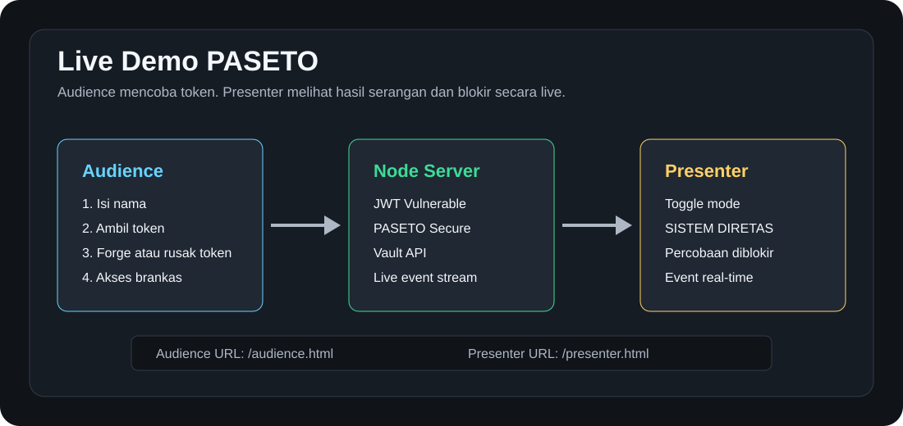
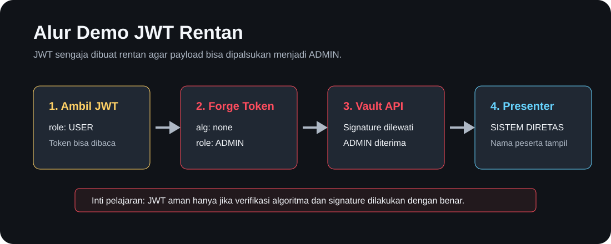
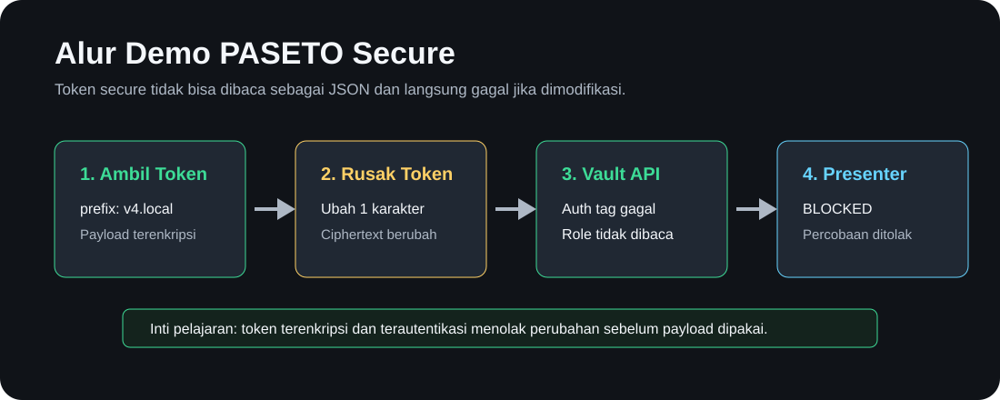

# Live Demo PASETO

Live Demo PASETO adalah aplikasi demo interaktif untuk presentasi keamanan token dan analisis performa. Demo ini menggunakan library standar resmi (**jsonwebtoken** dan **paseto**), memperlihatkan perbedaan antara JWT yang sengaja dibuat rentan terhadap `alg:none` dan token secure PASETO `v3.local` yang terenkripsi AEAD serta menolak manipulasi 1 bit pun. Aplikasi ini juga dilengkapi halaman benchmark parametrik untuk membandingkan kecepatan (ops/sec & latensi) serta ukuran token.



## Isi Demo

- Halaman audience untuk peserta mengisi nama, mengambil token, dan mencoba akses brankas.
- Halaman presenter dengan kontrol eksklusif untuk memindahkan mode keamanan secara real-time.
- Halaman benchmark interaktif (`/benchmark.html`) untuk menguji kecepatan (ops/detik, latensi $\mu$s) dan ukuran token (byte, overhead, breakdown) secara live.
- Mode `JWT Vulnerable` menggunakan library standar `jsonwebtoken` yang sengaja menerima token palsu `alg:none`.
- Mode `PASETO Secure` menggunakan library resmi `paseto` dengan token `v3.local` terenkripsi AEAD (`AES-256-CTR` + `HMAC-SHA384`).
- Sinkronisasi real-time memakai Server-Sent Events (SSE).

## Prasyarat

Pastikan sudah ada:

- Node.js versi 20 atau lebih baru.
- Browser modern seperti Chrome, Edge, Safari, atau Firefox.
- Jalankan `npm install` untuk menginstal dependensi resmi (`jsonwebtoken` dan `paseto`).

## Cara Instalasi

Clone repository:

```bash
git clone https://github.com/Andreean26/demo_paseto.git
cd demo_paseto
npm install
```

Jalankan server:

```bash
npm start
```

Jika berhasil, terminal akan menampilkan URL seperti ini:

```text
Live Demo PASETO running
Audience  : http://localhost:8080/audience.html
Presenter : http://localhost:8080/presenter.html
Benchmark : http://localhost:8080/benchmark.html
LAN URLs :
  Audience  : http://192.168.x.x:8080/audience.html
  Presenter : http://192.168.x.x:8080/presenter.html
  Benchmark : http://192.168.x.x:8080/benchmark.html
```

## Buka Halaman Demo

Di laptop presenter:

- Buka URL `Presenter` yang dicetak di terminal untuk mengubah mode dan menampilkan event.

Di HP peserta:

- Bagikan hanya URL `Audience` pada bagian `LAN URLs`.
- Contoh: `http://192.168.x.x:8080/audience.html`
- Pastikan laptop dan HP berada di Wi-Fi yang sama.

## Alur Demo JWT Rentan



1. Buka halaman `Audience`.
2. Isi nama peserta.
3. Presenter mengaktifkan mode `JWT Vulnerable`.
4. Halaman audience berpindah otomatis dan token JWT role `USER` akan muncul atau diperbarui.
5. Klik `Decode token` untuk melihat header `alg: HS256`, payload `role: USER`, dan signature awal.
6. Klik `Forge JWT ADMIN`; decoder akan memperbarui hasil menjadi `alg: none`, `role: ADMIN`, dan signature kosong.
7. Klik `Akses brankas rahasia`.
8. Halaman presenter akan menampilkan pesan `SISTEM DIRETAS`.

Kenapa bisa tembus:

- Token JWT palsu dibuat dengan header `alg: none`.
- Backend demo sengaja dibuat rentan dan menerima token tersebut tanpa validasi signature.
- Payload token bisa diubah dari `role: USER` menjadi `role: ADMIN`.

## Alur Demo PASETO Secure



1. Buka halaman `Audience`.
2. Isi nama peserta.
3. Presenter mengaktifkan mode `PASETO Secure`.
4. Halaman audience berpindah otomatis dan token secure dengan prefix `v4.local` akan muncul atau diperbarui.
5. Klik `Decode token` untuk melihat bahwa payload tetap opaque dan terenkripsi tanpa kunci.
6. Klik `Rusak 1 karakter`.
7. Klik `Akses brankas rahasia`.
8. Request akan ditolak dengan status `BLOCKED`.

Kenapa tidak tembus:

- Payload token tidak terlihat sebagai JSON karena dienkripsi.
- Token memakai autentikasi data, sehingga perubahan satu karakter membuat validasi gagal.
- Backend menolak token rusak sebelum role bisa dibaca.

## Alur Presenter

1. Buka URL `Presenter` lengkap yang dicetak saat `npm start`.
2. Tampilkan halaman tersebut di proyektor.
3. Gunakan toggle `Mode Keamanan` untuk mengganti mode seluruh audience secara real-time.
4. Gunakan `Bersihkan event` untuk menghapus daftar event sebelum mengulang demo.
5. Saat JWT berhasil dijebol, presenter akan menampilkan notifikasi besar.
6. Saat token secure dirusak, event blokir akan muncul di daftar live event.

## Alur Audience

1. Buka `http://localhost:8080/audience.html`.
2. Isi nama peserta.
3. Klik `Ambil token mode aktif`.
4. Tunggu presenter memilih mode; halaman dan token akan diperbarui otomatis ketika mode berubah.
5. Klik `Decode token` untuk memeriksa struktur token saat ini.
6. Gunakan textarea token untuk melihat atau mengubah token; decoder ikut diperbarui setelah pertama kali dibuka.
7. Klik `Akses brankas rahasia` untuk mengirim token ke backend.

Tombol yang tersedia:

- `Ambil token mode aktif`: membuat token USER sesuai mode yang dipilih presenter.
- `Decode token`: membaca header, payload, dan signature JWT tanpa memverifikasi keasliannya; untuk token secure hanya menampilkan struktur opaque.
- `Forge JWT ADMIN`: tampil hanya dalam mode JWT dan membuat token palsu dengan `alg:none` serta role `ADMIN`.
- `Rusak 1 karakter`: tampil hanya dalam mode PASETO dan mengubah karakter terakhir token untuk menguji tamper detection.
- `Salin token`: menyalin token ke clipboard.

## Struktur Proyek

```text
demo_paseto/
+-- README.md
+-- package.json
+-- server.js
+-- public/
|   +-- audience.html
|   +-- audience.js
|   +-- presenter.html
|   +-- presenter.js
|   +-- styles.css
+-- docs/
    +-- images/
        +-- app-overview.svg
        +-- jwt-flow.svg
        +-- paseto-flow.svg
```

## Endpoint API

| Method | Path | Fungsi |
| --- | --- | --- |
| `GET` | `/api/state` | Melihat mode aktif dan event terbaru. |
| `POST` | `/api/mode` | Mengganti mode ke `jwt` atau `paseto`. |
| `POST` | `/api/reset` | Menghapus event presenter. |
| `POST` | `/api/auth/generate` | Membuat token role `USER`. |
| `POST` | `/api/vault/access` | Menguji akses brankas memakai token di header `Authorization`. |
| `GET` / `POST` | `/api/benchmark` | Menjalankan benchmark kecepatan dan ukuran token parametrik. |
| `GET` | `/events` | Stream mode dan event real-time untuk presenter serta audience. |

## Konfigurasi Opsional

Port default adalah `8080`. Untuk mengganti port:

```bash
PORT=3000 npm start
```

Secret demo bisa diganti dengan environment variable:

```bash
JWT_DEMO_SECRET="secret-jwt-demo" PASETO_DEMO_KEY="secret-paseto-demo" npm start
```

## Troubleshooting

Jika port `8080` sudah dipakai:

```bash
PORT=3000 npm start
```

Jika HP tidak bisa membuka URL LAN:

- Pastikan laptop dan HP berada di Wi-Fi yang sama.
- Pastikan memakai URL `http://192.168.x.x:8080/audience.html` dari terminal, bukan `localhost`.
- Cek firewall laptop jika request dari perangkat lain diblokir.

Jika audience tidak berpindah mode:

- Pastikan audience masih terhubung ke server yang sama dengan presenter.
- Refresh halaman audience untuk menyambungkan ulang stream SSE.
- Setelah nama peserta sudah dikirim, ubah mode dari toggle di halaman presenter dan pastikan token ikut diperbarui.

Jika presenter tidak menerima event:

- Refresh halaman presenter.
- Pastikan server masih berjalan.
- Buka ulang URL `Presenter` yang dicetak di terminal.

## Catatan Keamanan

Demo ini dibuat untuk edukasi. Kontrol presenter tidak memakai key, jadi jalankan demo hanya di lingkungan tepercaya. Mode JWT memang sengaja dibuat rentan agar serangan `alg:none` mudah dipahami. Jangan menggunakan logic JWT rentan dari demo ini untuk aplikasi produksi.

Implementasi secure lokal memakai AEAD `AES-256-GCM` dengan prefix `v4.local` agar demo bisa berjalan tanpa dependency eksternal. Untuk implementasi produksi, gunakan library PASETO resmi dan audit konfigurasi kunci dengan serius.
